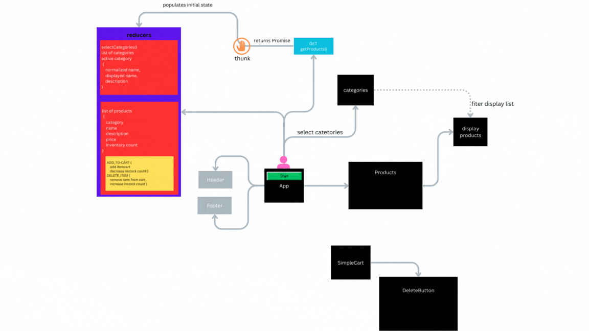

# Storefront Application using Redux and MUI

Welcome to the Storefront Application! This is the first phase of the application build, written in React. The goal of this phase is to set up the basic structure, styling, and functionality of the application. The application will provide a user-friendly interface for browsing and shopping for products in various categories. The state management will be handled using Redux to ensure scalability and efficient handling of data.

[Deoloyed site]('https://main--transcendent-monstera-1d9151.netlify.app/')

## User Stories

As a user, here are the features you can expect in this phase:

1. View a list of available product categories in the store for easy browsing.
2. Choose a category and see a list of all available products matching that category.
3. Enjoy a clean and user-friendly interface to confidently navigate and shop in the online store.

## Technical Details

As developers, here are the high-level development tasks that address the user requirements:

1. Create a visually appealing site using Material UI, a popular UI framework for React.
2. Utilize a Redux Store to manage the state of categories and items in the store.
3. Display a list of categories from the state.
4. When a user selects a category, visually indicate the selection and show a list of products associated with that category.

### Application Architecture

To get started with the Storefront Application, follow these steps:

1. Begin by creating your application using create-react-app command or any preferred React setup.
2. Install Material UI as a dependency in your project to leverage its pre-built UI components and styles.
3. Write an `<App />` component that will serve as the container for all sub-components of this application.
4. Create a `<Categories />` component that:

- Shows a list of all categories fetched from the state.
- Dispatches an action when a category is clicked to activate it.
- Develop a `<Products />` component that:
- Displays a list of products associated with the selected category.
- Update the product list dynamically based on the selected category.
- Structure your project in a scalable manner, separating components into their respective files and folders.

### Getting Started

To run the Storefront Application locally, follow these steps:

1. Clone the repository: git clone https://github.com/your/repository.git.
2. Navigate to the project directory: cd storefront-app.
3. Install the dependencies: npm install.
4. Start the development server: npm start.
5. Open your browser and visit http://localhost:3000 to access the application

### Feedback and Contributions

We welcome feedback and contributions to enhance the Storefront Application. If you encounter any issues or have suggestions for improvement, please open an issue on the project repository. Feel free to submit pull requests with your proposed changes.

### License

The Storefront Application is released under the MIT License.